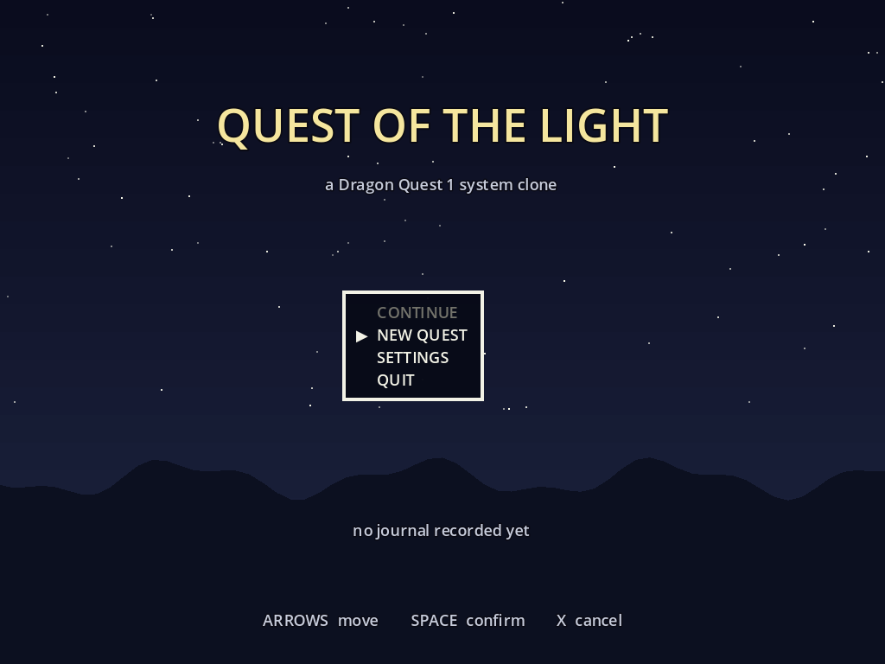
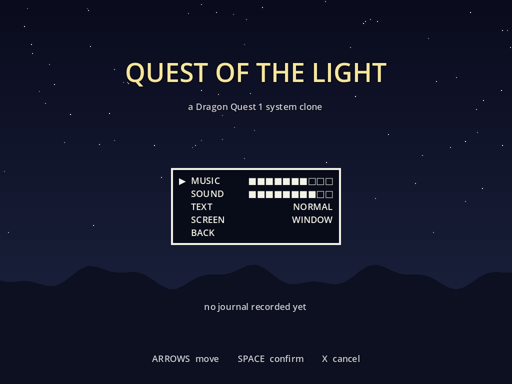
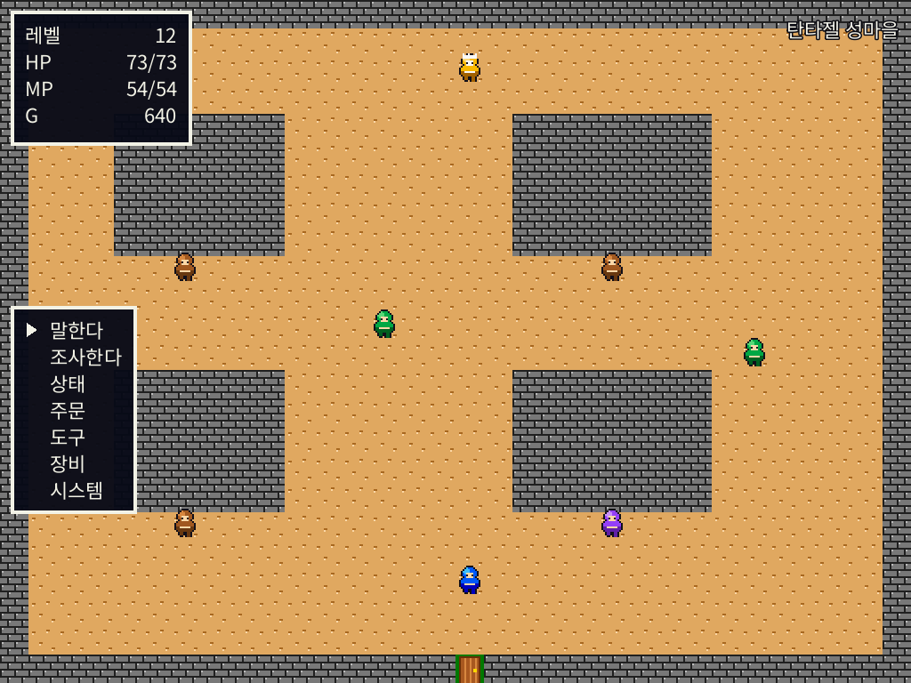
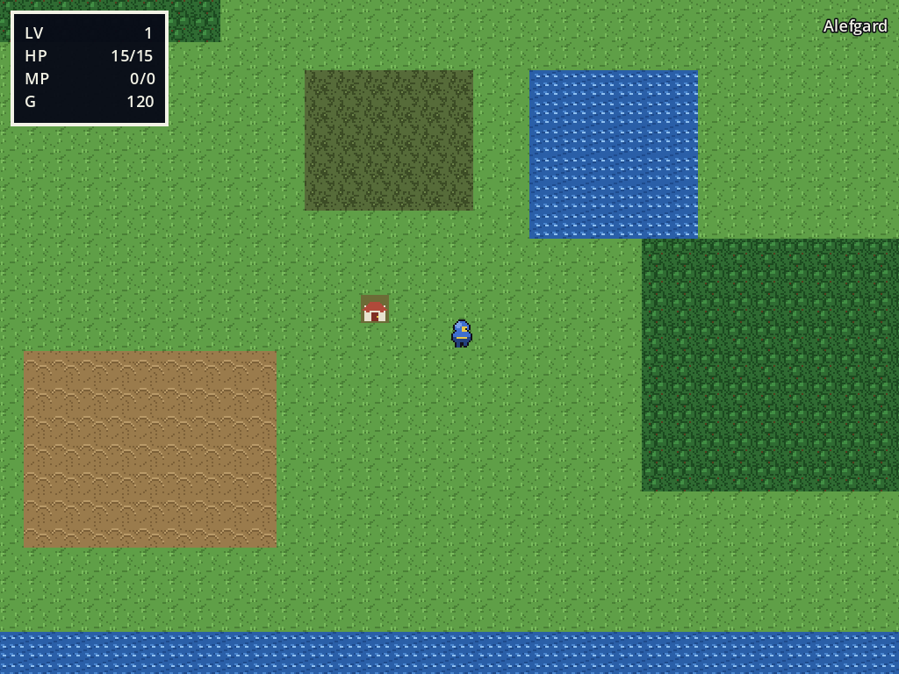
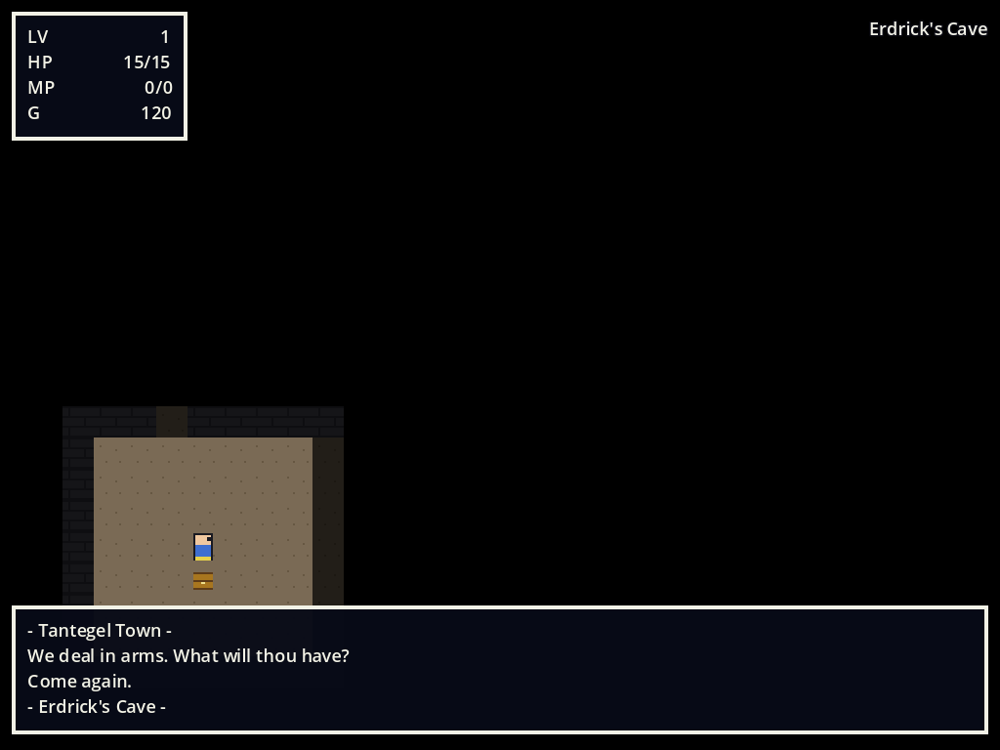
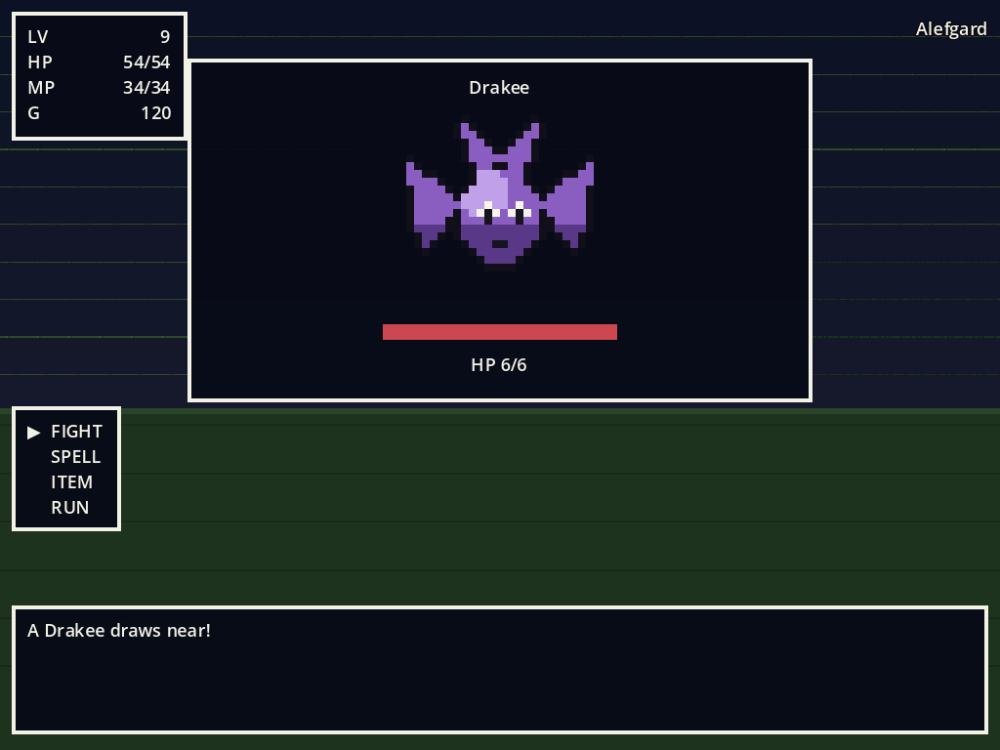
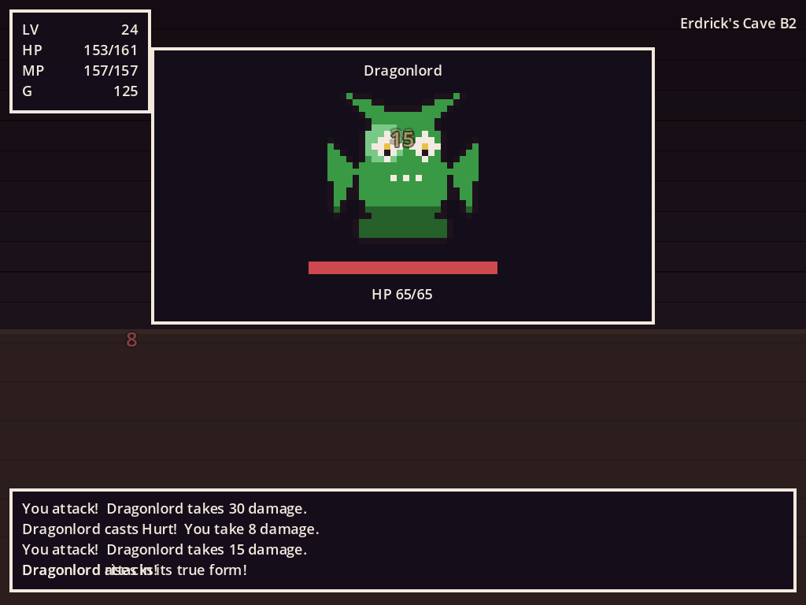
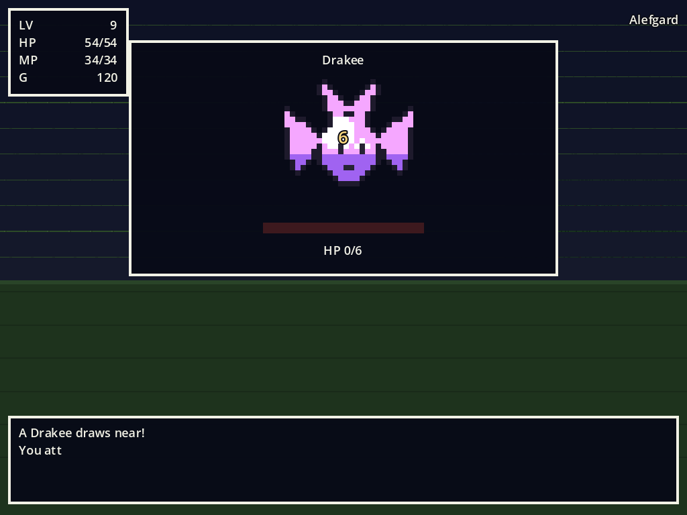

# Quest of the Light — Dragon Quest 1 Clone (Godot 4)

초대 드래곤 퀘스트(1986, NES)의 **시스템 클론**. 2D로 먼저 만들고, 이후 2.5D 리메이크로 이어집니다.

> **현재 상태: M0~M6 완료.** 타이틀에서 시작해 마을에서 장비를 사고, 여관에서 자고,
> 왕에게 세이브하고, 필드에서 레벨을 올려 던전 2층의 마왕을 쓰러뜨리는 것까지
> **사운드와 음악이 붙은 채로** 처음부터 끝까지 플레이됩니다.

| 타이틀 | 설정 |
| --- | --- |
|  |  |
| **마을** | **필드** |
|  |  |
| **던전 (시야 제한)** | **전투 — 지형 배경 · 데미지 표시** |
|  |  |
| **보스 2페이즈** | **피격 연출** |
|  |  |

## 실행

1. [Godot 4.4 이상](https://godotengine.org/download) 설치
2. **Import** → 이 폴더의 `project.godot`
3. **F5**

| 동작 | 키 |
| --- | --- |
| 이동 | 방향키 |
| 메뉴 열기 / 확인 | Space, Enter, Z |
| 취소 | Esc, X |
| 설정 값 조절 | ← → |
| 메시지 넘기기 | 아무 키 |

필드 메뉴: `TALK` `TAKE` `STATUS` `SPELL` `ITEM` `EQUIP` · 전투 메뉴: `FIGHT` `SPELL` `ITEM` `RUN`

## 구현 상태

| | |
| --- | --- |
| 그리드 이동, 지형 통행, 늪 데미지, NPC 충돌 | ✅ |
| 마을 ↔ 필드 ↔ 던전 B1 ↔ B2 워프 | ✅ |
| 랜덤 인카운터, 지형별 조우율, Repel | ✅ |
| 턴제 전투 (공격/회심의 일격/선공/도망) | ✅ |
| 주문 10종 (전투 6 + 필드 4), 수면·주문봉인 | ✅ |
| EXP·골드·레벨업·주문 습득 | ✅ |
| 타자기 메시지 창, DQ식 커맨드 메뉴 | ✅ |
| NPC 대화 + 이벤트 플래그 분기 | ✅ |
| 상점 3종, 여관, 장비 교체, 소지품 10칸 | ✅ |
| 왕에게 세이브 / 사망 → 골드 절반 → 부활 | ✅ |
| 던전 시야 제한, 횃불, Radiant, 보물상자 | ✅ |
| 보스전 — 도망·회심 불가, **2페이즈 변신** | ✅ |
| **타이틀 · CONTINUE · 설정(볼륨/창모드)** | ✅ M6 |
| **효과음 19종 · 루프 BGM 5곡** | ✅ M6 |
| **몬스터·캐릭터·타일 스프라이트** | ✅ M6 |
| **온보딩 — 퀘스트 안내, 첫 방문 힌트** | ✅ M6 |
| **지형별 전투 배경, 인카운터 플래시, 데미지 숫자** | ✅ |
| **레벨업 스탯 상승 표시, 메시지 속도 설정** | ✅ |
| 2.5D 리메이크 | ❌ M7 |

## 에셋은 전부 생성됩니다

외부에서 가져온 에셋이 **하나도 없습니다.** 타일·스프라이트·효과음·음악이 모두
`tools/`의 생성기에서 나옵니다. 원래 M6 계획은 CC0 타일셋을 쓰는 것이었지만 개발
환경에서 외부 에셋을 받을 수 없었고, **받아온 척하는 대신 전부 생성**했습니다.

- 스프라이트: 실루엣을 프리미티브로 기술하고 **외곽선 패스**를 돌립니다 — 이 패스
  하나가 "색칠한 도형"을 스프라이트로 바꿔주고, 종을 늘려도 추가 비용이 없습니다
- 오디오: 펄스·삼각파·노이즈를 float 버퍼에 합성 → 16비트 PCM. `.wav`가 아니라
  `.tres`로 저장해 **루프 지점을 리소스 안에** 넣습니다

생성기는 전부 결정적이라 몇 번 돌려도 바이트 단위로 같은 결과가 나옵니다.
자세한 건 [docs/08-ASSETS.md](docs/08-ASSETS.md) — 진짜 에셋으로 교체하는 방법도 여기 있습니다.

## 구조

핵심 규칙은 두 개뿐입니다. 이게 지켜지는 한 2.5D 리메이크는 **뷰 교체**로 끝납니다.

> 1. **`core/`는 `view_2d/`를 절대 참조하지 않는다.** 통신은 시그널로 단방향.
> 2. **`core/`에는 `Node2D`/`Node3D`/`Control`이 없다.** 순수 GDScript 클래스와 `Resource`만.

M3(전투 화면)은 이 규칙의 실전 검증이었습니다 — **`core/` 변경 0줄**로 완료했습니다.

`core/`가 한 턴을 즉시 해결해 **이벤트 목록**으로 돌려주고, 뷰가 그걸 타자기 속도로
재생합니다. 애니메이션을 기다리지 않으므로 같은 전투를 0초에 1000번 돌릴 수 있습니다.

자세한 건 [docs/04-ARCHITECTURE.md](docs/04-ARCHITECTURE.md).

## 툴 (전부 헤드리스)

```bash
G=godot   # 4.4+

# 에셋·데이터 시딩 — 최초 1회, 또는 다시 만들 때만
$G --headless --path . --script res://tools/build_tiles.gd
$G --headless --path . --script res://tools/build_sprites.gd
$G --headless --path . --script res://tools/build_audio.gd
$G --headless --path . --import
$G --headless --path . --script res://tools/build_data.gd
$G --headless --path . --import

# 상시 검증 — 합계 1,137 checks
$G --headless --path . --script res://tools/validate_data.gd      # 649
$G --headless --path . --script res://tools/test_core.gd          # 223
$G --headless --path . --script res://tools/test_presentation.gd  # 249
$G --headless --path . --script res://tools/smoke_view.gd         #  16

# 밸런스 리포트 → docs/07-BALANCE_REPORT.md
$G --headless --path . --script res://tools/simulate_balance.gd
```

`smoke_view.gd`는 **실제 씬을 띄워 프레임 단위로 플레이합니다** — 곤봉을 사고, 장비하고,
여관에서 자고, 왕에게 세이브하고, 마을을 나가 전투를 치르고, 던전에서 상자를 열고,
마왕을 쓰러뜨립니다. 메뉴를 눌러 진행하므로 **입력을 기다리다 멈추는 데드락**도 잡힙니다.

## 밸런스는 눈이 아니라 시뮬레이션으로

`simulate_balance.gd`가 30레벨 × 9몬스터 × 120전투를 약 3초에 돌려 승률표, 보스 격파
가능 레벨, 필요 전투/걸음 수, **골드 여유 배수**를 뽑습니다.

현재: **약 672전투 / 6,922보, 보스 격파 Lv17~18** (원작 권장 18~20에 근접),
**골드 여유 3.1배**. 상세는 [docs/07-BALANCE_REPORT.md](docs/07-BALANCE_REPORT.md).

## 원작 수치에 대하여

전투 공식은 출처마다 충돌합니다. 값마다 검증 상태(✅/⚠️/❓)를 달고, 공식과 상수를
`core/battle/formulas.gd` 한 파일에 모아 나중에 데이터만 고칠 수 있게 했습니다.
판정 기록은 [docs/06-VERIFICATION.md](docs/06-VERIFICATION.md).

## 문서

| | 내용 |
| --- | --- |
| [00-ENGINE_DECISION.md](docs/00-ENGINE_DECISION.md) | 왜 Godot인가 |
| [01-GDD.md](docs/01-GDD.md) | 게임 개요, 클론 원칙, 범위, 비목표 |
| [02-SYSTEMS.md](docs/02-SYSTEMS.md) | 시스템 명세 + 원작 공식 |
| [03-DATA.md](docs/03-DATA.md) | Resource 스키마와 테이블 |
| [04-ARCHITECTURE.md](docs/04-ARCHITECTURE.md) | core/view 분리, 헤드리스 테스트 |
| [05-ROADMAP.md](docs/05-ROADMAP.md) | M0~M7 마일스톤 |
| [06-VERIFICATION.md](docs/06-VERIFICATION.md) | 원작 수치 검증 기록 |
| [07-BALANCE_REPORT.md](docs/07-BALANCE_REPORT.md) | 밸런스 리포트 (자동 생성) |
| [08-ASSETS.md](docs/08-ASSETS.md) | 에셋 생성 파이프라인과 교체 방법 |

## 주의

학습용 클론입니다. 원작의 이름·캐릭터·아트·음악은 스퀘어에닉스의 자산이며 이 저장소에
포함되지 않습니다. 타이틀과 모든 에셋은 이 프로젝트의 자체 생성물입니다.
다만 지명(Alefgard, Tantegel)은 개발 중 참조용으로 남아 있으며, 공개 배포 시
`01-GDD.md`의 클론 원칙에 따라 교체 대상입니다.
