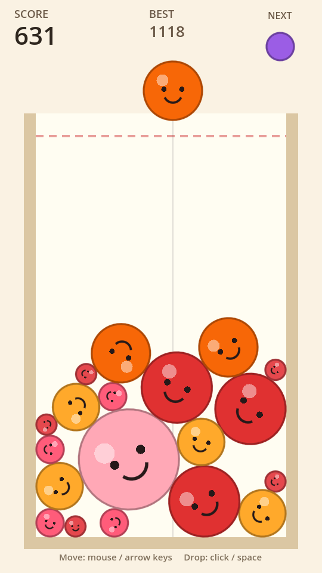

# Suika Game Clone (Godot 4)

수박게임(Suika Game) 스타일의 물리 기반 과일 합치기 게임 클론입니다.
같은 종류의 과일 두 개가 닿으면 한 단계 큰 과일로 합쳐지고, 항아리가 데드라인
위로 넘치면 게임이 끝납니다.



- 엔진: **Godot 4.4** (GL Compatibility 렌더러)
- 언어: **GDScript**
- 외부 에셋 없음 — 모든 과일은 `_draw()`로 런타임에 그립니다.

## 실행 방법

1. [Godot 4.4 이상](https://godotengine.org/download) 다운로드 (C# 안 쓰므로 표준 빌드면 됩니다)
2. Godot 실행 → **Import** → 이 폴더의 `project.godot` 선택
3. **F5** (또는 우측 상단 ▶) 로 실행

## 조작

| 동작 | 키 |
| --- | --- |
| 투하 위치 이동 | 마우스 이동 / ← → |
| 과일 떨어뜨리기 | 좌클릭 / Space |
| 재시작 | 게임오버 후 클릭 또는 Space |

## 규칙

- 과일은 11단계: Cherry → Strawberry → Grape → Dekopon → Persimmon → Apple →
  Pear → Peach → Pineapple → Melon → **Watermelon**
- 투하로 나오는 과일은 1~5단계뿐입니다 (`FruitData.DROPPABLE_MAX`)
- 같은 단계 두 개가 닿으면 합쳐지고, 생성된 과일의 단계만큼 점수를 얻습니다
- 수박 두 개가 닿으면 둘 다 사라지고 2배 점수
- 과일이 데드라인 위에 **2초간 머물면** 게임 오버
- 최고 점수는 `user://suika_save.cfg`에 저장됩니다

## 프로젝트 구조

```
suika-game/
├── project.godot          # 엔진 설정 (해상도 540x960, 중력, 렌더러)
├── icon.svg
├── scenes/
│   ├── main.tscn          # 항아리 콜리전 + UI + 게임 루트
│   └── fruit.tscn         # RigidBody2D 과일 한 개
├── scripts/
│   ├── game.gd            # 게임 루프: 투하, 병합, 점수, 게임오버
│   ├── fruit.gd           # 과일 본체: 충돌 감지, 물리 안전장치, 그리기
│   ├── fruit_data.gd      # 밸런스 테이블 (이름/반지름/색/점수)
│   └── playfield.gd       # 항아리 좌표·물리 한계 상수 (단일 진실 공급원)
├── tools/
│   └── smoke_test.gd      # 헤드리스 자동 플레이 테스트
└── docs/
    ├── DEVELOPMENT.md     # 개발이 어떤 식으로 굴러가는지
    └── STEAM_RELEASE.md   # 스팀 출시 절차
```

## 자동 테스트

에디터 없이 실제 게임을 40회 자동 투하시켜 병합·점수·물리가 살아있는지 확인합니다.
CI에 그대로 걸 수 있고, 실패하면 exit code 1을 돌려줍니다.

```bash
godot --headless --path . --import          # 최초 1회 (클래스 등록 + 에셋 임포트)
godot --headless --path . --script res://tools/smoke_test.gd
# [smoke] score=327  fruits_in_jar=19
# [smoke] PASS
```

## 밸런스 조정 포인트

| 바꾸고 싶은 것 | 위치 |
| --- | --- |
| 과일 크기·색·점수·단계 수 | `scripts/fruit_data.gd` |
| 항아리 크기, 데드라인 높이 | `scripts/playfield.gd` + `scenes/main.tscn`의 콜리전 |
| 낙하 속도감 | `project.godot` → `physics/2d/default_gravity` |
| 투하 쿨타임, 게임오버 유예 | `scripts/game.gd` 상단 상수 |

> `playfield.gd`의 좌표와 `main.tscn`의 `CollisionShape2D` 위치는 **같이** 바꿔야 합니다.

## 라이선스 / 주의

메커닉을 학습 목적으로 재구현한 클론입니다. 원작 *Suika Game* 의 이름, 캐릭터
디자인, 아트, 사운드는 Aladdin X 의 자산이며 이 저장소에는 포함되어 있지 않습니다.
상업적 출시를 고려한다면 `docs/STEAM_RELEASE.md` 의 "법적 체크" 항목을 먼저 읽으세요.
